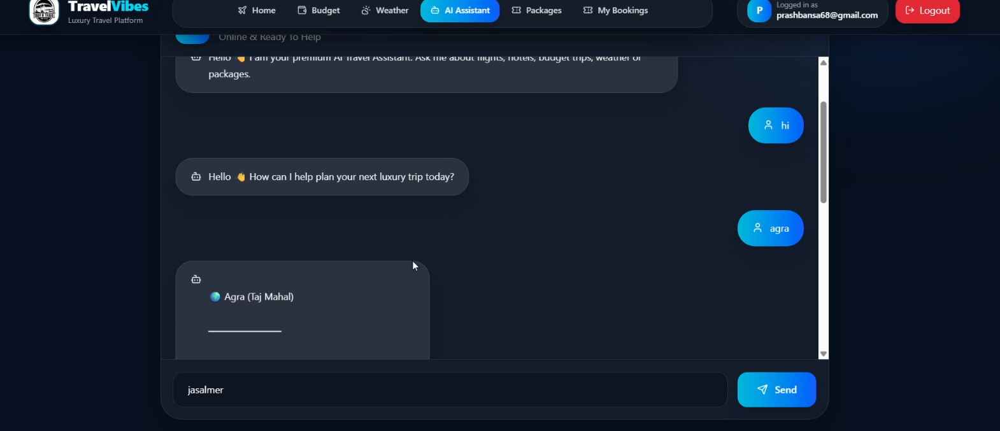
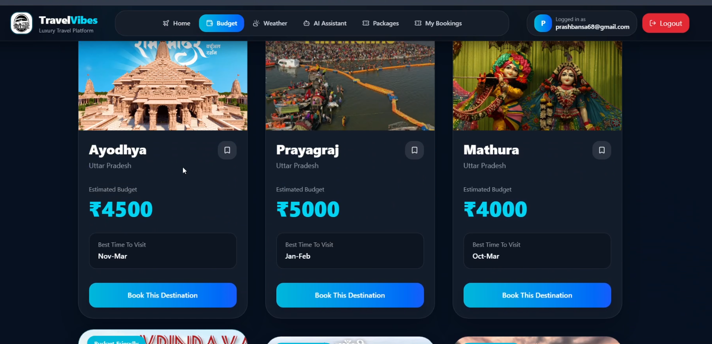
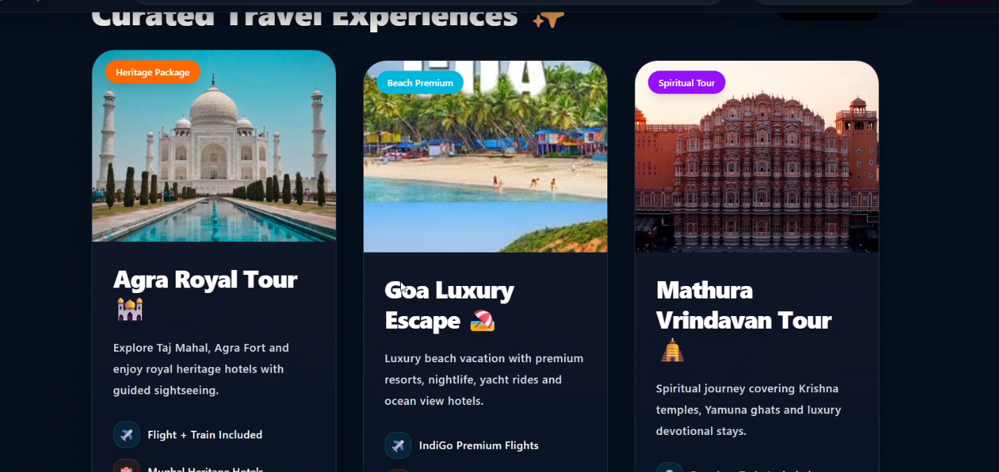
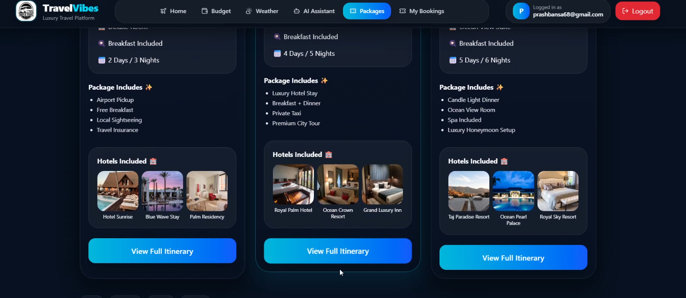
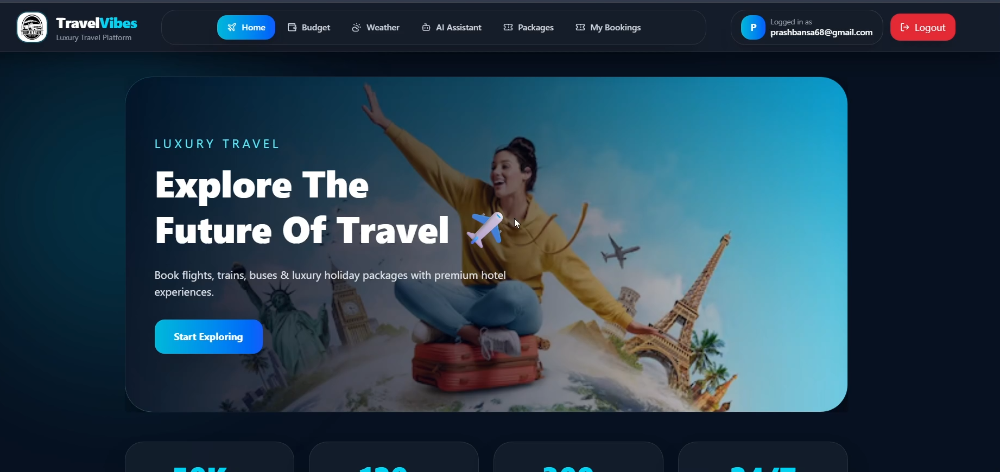
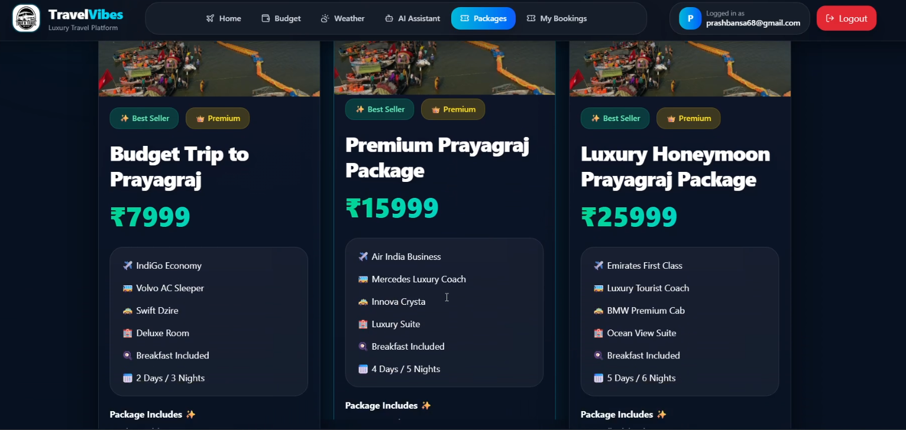
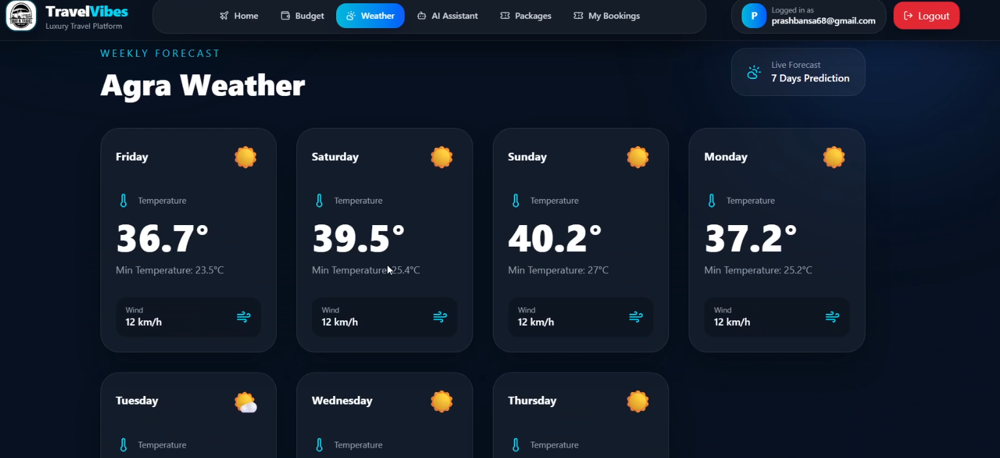

# travel-project 
<!-- hello
 -->
# 🌍 Travel With Vibes

A full-stack MERN Travel Booking application that allows users to explore destinations, register/login securely, and manage travel bookings through a responsive and modern interface.

> Built using React, Node.js, Express, MongoDB, and JWT Authentication.

---

## 📸 Preview

## 📸 Project Screenshots

### 🤖 AI Assistant


### 💾 Booking Saved Locally


### 💰 Budget Planner


### 🏨 Hotel Card


### 🗺️ Full Itinerary


### 📧 Gmail Notification


### 🏠 Home Page


### 📦 Travel Packages


### 🎫 PNR & Booking ID


### 🌦️ Weather Information

---

# 🚀 Features

### 👤 Authentication
- User Registration
- Secure Login
- JWT Authentication
- Password Encryption using bcrypt
- Protected Routes

### 🌍 Travel Features
- Browse travel destinations
- View destination details
- Book trips
- Manage bookings
- Responsive UI

### ⚡ Performance
- Fast React (Vite)
- REST API Architecture
- MongoDB Database
- Responsive Design

---

# 🛠 Tech Stack

## Frontend

- React.js
- Vite
- React Router
- Axios
- CSS

## Backend

- Node.js
- Express.js
- MongoDB
- Mongoose
- JWT
- bcrypt.js
- dotenv

---

# 📂 Project Structure

```
Travel-With-Vibes/
│
├── client/
│   ├── src/
│   ├── public/
│   └── package.json
│
├── server/
│   ├── controllers/
│   ├── models/
│   ├── routes/
│   ├── middleware/
│   ├── .env
│   └── server.js
│
└── README.md
```

---

# 🔐 Environment Variables

Create a `.env` file inside the server folder.

```
PORT=5000

MONGO_URI=your_mongodb_connection_string

JWT_SECRET=your_secret_key
```

---

# ⚙ Installation

Clone the repository

```bash
git clone https://github.com/yourusername/travel-project.git
```

Move inside project

```bash
cd travel-project
```

Install backend dependencies

```bash
cd server
npm install
```

Install frontend dependencies

```bash
cd ../client
npm install
```

---

# ▶ Running the Project

### Backend

```bash
cd server
npm run dev
```

### Frontend

```bash
cd client
npm run dev
```

Frontend

```
http://localhost:5173
```

Backend

```
http://localhost:5000
```

---

# 🔌 API Endpoints

## Authentication

| Method | Endpoint | Description |
|----------|-------------|----------------|
| POST | /api/auth/register | Register User |
| POST | /api/auth/login | Login User |

## Travel

| Method | Endpoint | Description |
|----------|-------------|----------------|
| GET | /api/travel | Get All Destinations |
| GET | /api/travel/:id | Destination Details |
| POST | /api/travel/book | Book Trip |

---

# 🔒 Security

- Password Hashing using bcrypt
- JWT Authentication
- Environment Variables
- Secure REST APIs

---

# 💡 Future Improvements

- Payment Gateway Integration
- Admin Dashboard
- Wishlist
- Email Verification
- Google Login
- Booking History
- Reviews & Ratings
- Search & Filters
- Image Upload

---

# 📈 Learning Outcomes

This project helped me strengthen my understanding of:

- Full Stack MERN Development
- REST APIs
- MongoDB & Mongoose
- JWT Authentication
- React Routing
- State Management
- Backend Architecture
- Authentication Flow
- Deployment

---

# 👨‍💻 Author

**Prabal Bansal**

B.Tech Student | MERN Stack Developer

GitHub:
https://github.com/yourusername

LinkedIn:
https://linkedin.com/in/yourprofile

Portfolio:
https://prabal49.github.io/prabal-portfolio/

---

# ⭐ If you like this project

Please give this repository a ⭐ on GitHub.
 